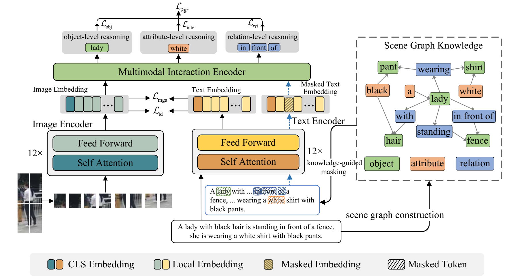

# Hierarchical Knowledge-Guided Reasoning for Text-based Person Re-identification (HKGR)  

[](LICENSE)  

This repository provides the official implementation of the paper:  
**Hierarchical Knowledge-Guided Reasoning for Text-based Person Re-identification**  

---

## 📌 Overview  
Text-based person re-identification (TIReID) aims to retrieve pedestrian images using natural language descriptions. Existing methods often struggle with fine-grained alignment due to random token masking in Masked Language Modeling (MLM). To address this, we propose **HKGR**, a framework that leverages **hierarchical scene graph knowledge** to guide token masking and enhance cross-modal reasoning. Key components include:  
- **Hierarchical Knowledge-Guided Reasoning (HKGR)**: Object-, attribute-, and relation-level masking guided by scene graphs.  

- **Multi-Grained Semantic Alignment (MGA)**: Coarse- and fine-grained alignment via token selection and similarity constraints.  

  

---

## 📊 Results  
### Benchmark Performance  
| Dataset    | R@1   | R@5   | R@10  | mAP   |
| ---------- | ----- | ----- | ----- | ----- |
| CUHK-PEDES | 75.21 | 90.22 | 94.31 | 67.28 |
| ICFG-PEDES | 65.29 | 81.17 | 86.22 | 39.40 |
| RSTPReid   | 63.10 | 83.60 | 88.90 | 49.74 |

---

## 🛠️ Installation  
1. **Clone the repository**:  
```bash  
git clone https://github.com/[YourUsername]/HKGR.git  
cd HKGR  
```

2. **Install dependencies**:  
```bash  
pip install -r requirements.txt  
```

**Requirements**:  
- Python 3.8+  
- PyTorch 1.12+  
- Transformers 4.20+  
- CUDA 11.3+  

---

## 🏃 Usage  
### Data Preparation  
1. Download datasets: [CUHK-PEDES](https://...), [ICFG-PEDES](https://...), [RSTPReid](https://...).  
2. Organize data into `./data/[dataset_name]` following the structure:  
```  
├── train  
│   ├── images  
│   └── text  
├── val  
└── test  
```

### Training  
Take the CUHK_PEDES dataset for example: 
```bash  
sh ./options/run_cuhk_pedes.sh  
```
**Key Arguments**:  

- `--root_dir`: Dataset path(`CUHK-PEDES`, `ICFG-PEDES`, `RSTPReid`).  
- `--mlm_type`: Token masking type (default: 'obj+attr+rel`).  
- `--loss_names`: loss function (default: `sdm+mlm`).  

### Evaluation  
```bash  
CUDA_VISIBLE_DEVICES=0 python test.py --config_file 'path_of_checkpoint/configs.yaml' 
```

---

## 🙏 Acknowledgements  
Some components of this code implementation are adopted from [CLIP](https://github.com/openai/CLIP), [TextReID](https://github.com/BrandonHanx/TextReID) and [TransReID](https://github.com/damo-cv/TransReID). We sincerely appreciate for their contributions.

## 📜Contact

If you have any question, please feel free to contact us. E-mail: zengruigeng@nudt.edu.cn
